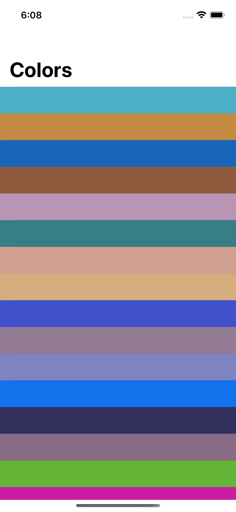
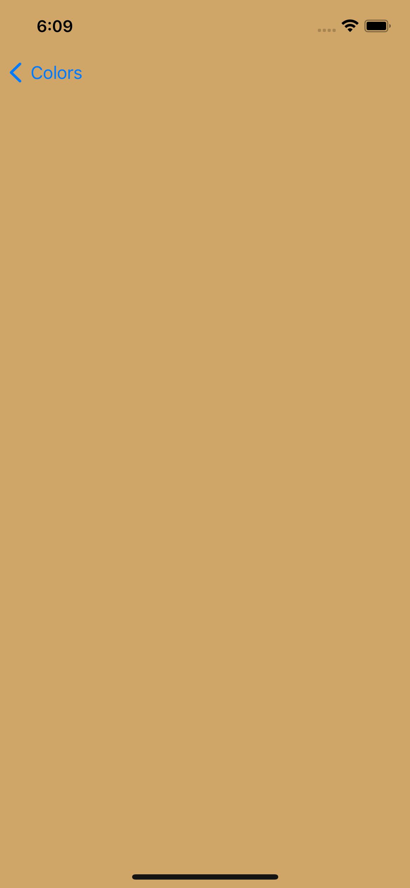

# RandomColorsApp

## Overview

The Random Colors App is a simple iOS application that allows users to click on a cell with a pastel-colored background and open a new view. The new view will display a cell with the same pastel-colored background as the one that the user clicked on.

## Installation

1. Clone or download the repository to your local machine.
2. Open the RandomColors.xcodeproj file in Xcode.
3. Select a simulator or a physical device to run the app on.
4. Click the "Run" button in Xcode to build and run the app.

## Pictures

